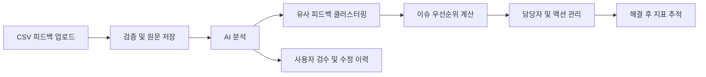

# VOC ActionOps

고객 리뷰, 문의, 설문 데이터를 반복 이슈로 구조화하고 우선순위 산정, 담당자 액션 관리, 해결 후 지표 추적까지 연결하는 AI 기반 고객 피드백 운영 플랫폼입니다.

단순 감성 분석 대시보드가 아니라, 흩어진 고객 피드백이 실제 개선 작업으로 이어지도록 만드는 운영 흐름을 구현하는 것이 목표입니다.

## 핵심 흐름



## 프로젝트에서 보여주는 것

- 원문 `Feedback`과 운영 단위 `Issue`를 분리한 도메인 설계
- AI 결과의 신뢰도, 원문 근거, 사용자 수정 이력을 남기는 Human-in-the-loop 구조
- 빈도, 부정도, 긴급도, 증가율, 고객 영향도를 반영하는 우선순위 모델
- 조직 단위 데이터 격리와 역할 기반 권한 제어
- 대량 CSV 처리와 AI 분석을 분리한 비동기 확장 구조
- 이슈 해결 전후 지표를 비교할 수 있는 스냅샷 설계

## 현재 구현 상태

| 구분 | 상태 | 내용 |
| --- | --- | --- |
| 프로젝트 설계 | 완료 | 문제 정의, 요구사항, 도메인 모델, ERD, API 초안 |
| 백엔드 기반 | 완료 | Java 17, Spring Boot 4.1, Gradle 9, 테스트 환경 |
| 로컬 인프라 | 완료 | Docker Compose 기반 MySQL 8.4, Redis 7.4 |
| 운영 기반 | 완료 | 환경별 설정, Health Check, OpenAPI/Swagger |
| 공통 API 구조 | 예정 | 공통 응답, 에러 코드, 전역 예외 처리 |
| 핵심 기능 | 예정 | 인증, CSV 업로드, AI 분석, 이슈·액션, 대시보드 |
| 프론트엔드·AI Worker | 예정 | Next.js 운영 화면, FastAPI 분석 워커 |

## 기술 스택

현재 적용된 기술과 이후 구현할 기술을 구분합니다.

### Backend

- Java 17
- Spring Boot 4.1
- Spring Web MVC, Spring Security, Spring Data JPA, Validation
- MySQL, H2
- Spring Boot Actuator
- springdoc-openapi
- Gradle 9

### Planned

- QueryDSL, Redis
- Next.js, TypeScript, TanStack Query, Tailwind CSS
- Python, FastAPI
- AWS S3, SQS
- GitHub Actions

## 로컬 실행

사전 준비: Java 17 이상, Docker Desktop

```bash
cp .env.example .env
docker compose up -d
cd backend
./gradlew bootRun
```

실행 후 확인할 수 있는 주소:

- Health Check: `http://localhost:8080/actuator/health`
- Swagger UI: `http://localhost:8080/swagger-ui.html`
- OpenAPI JSON: `http://localhost:8080/v3/api-docs`

테스트와 빌드:

```bash
cd backend
./gradlew clean test
./gradlew clean build
```

## 문서

- [문제 정의](docs/problem_definition.md)
- [요구사항](docs/requirements.md)
- [도메인 모델](docs/domain_model.md)
- [ERD](docs/erd.md)
- [API 명세](docs/api.md)

## 구현 순서

1. 공통 응답 및 예외 처리
2. 사용자 인증과 조직 단위 권한
3. Dataset·Feedback 도메인과 CSV 업로드
4. AI 분석 결과 저장과 사용자 보정
5. Issue·Action 관리
6. 대시보드와 해결 후 지표 추적
7. 비동기 처리, 캐시, 배포 자동화 고도화
