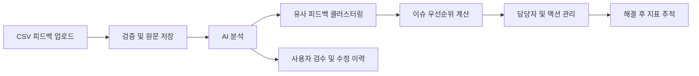

# VOC ActionOps

고객 리뷰, 문의, 설문 데이터를 반복 이슈로 구조화하고 우선순위 산정, 담당자 액션 관리, 해결 후 지표 추적까지 연결하는 AI 기반 고객 피드백 운영 플랫폼입니다.

단순 감성 분석 대시보드가 아니라, 흩어진 고객 피드백이 실제 개선 작업으로 이어지도록 만드는 운영 흐름을 구현하는 것이 목표입니다.

## 핵심 흐름



## 설계 방향

- 원문 `Feedback`과 운영 단위 `Issue`를 분리한 도메인 설계
- AI 결과의 신뢰도, 원문 근거, 사용자 수정 이력을 남기는 Human-in-the-loop 구조
- 빈도, 부정도, 긴급도, 증가율, 고객 영향도를 반영하는 우선순위 모델
- 조직 단위 데이터 격리와 역할 기반 권한 제어
- 대량 CSV 처리와 AI 분석을 분리한 비동기 확장 구조
- 이슈 해결 전후 지표를 비교할 수 있는 스냅샷 설계

## 기술 구성

### Backend

- Java 17
- Spring Boot 4.1
- Spring Web MVC, Spring Security, Spring Data JPA, Validation
- Flyway
- Gradle 9

### Data & Infrastructure

- MySQL 8.4
- Redis 7.4
- Docker Compose
- GitHub Actions

### Test & API Documentation

- JUnit 5, H2
- Spring Security Test, MockMvc
- Spring Boot Actuator
- springdoc-openapi

## 저장소 구조

```text
.
|-- backend/                 Spring Boot API 서버
|-- docs/                    요구사항, 도메인, ERD, API 문서
|-- docker-compose.yml       MySQL, Redis 로컬 환경
|-- .env.example             로컬 환경 변수 예시
`-- .github/workflows/       백엔드 CI
```

## 로컬 실행

사전 준비: Java 17 이상, Docker Desktop

```bash
cp .env.example .env
docker compose up -d
cd backend
./gradlew bootRun
```

애플리케이션 시작 시 Flyway가 데이터베이스 마이그레이션을 적용하고, JPA는 엔티티와 스키마가 일치하는지 검증합니다.

실행 후 확인할 수 있는 주소:

- Health Check: `http://localhost:8080/actuator/health`
- Swagger UI: `http://localhost:8080/swagger-ui.html`
- OpenAPI JSON: `http://localhost:8080/v3/api-docs`

테스트와 빌드:

```bash
cd backend
./gradlew clean test
./gradlew clean build
```

## 문서

- [문제 정의](docs/problem_definition.md)
- [요구사항](docs/requirements.md)
- [도메인 모델](docs/domain_model.md)
- [ERD](docs/erd.md)
- [API 명세](docs/api.md)
