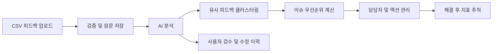

# VOC ActionOps

고객 리뷰, 문의, 설문처럼 여러 채널에 흩어진 VOC를 한곳에 모아 분석하고, 반복되는 문제를 실제 처리 이슈와 액션으로 연결하는 프로젝트입니다.

데이터 업로드와 검증부터 AI 분석, 담당자 조치, 해결 후 변화 확인까지 운영자가 사용하는 전체 흐름을 다룹니다.

## 핵심 흐름


```mermaid
flowchart LR
    A[CSV 피드백 업로드] --> B[검증 및 원문 저장]
    B --> C[AI 분석]
    C --> D[유사 피드백 클러스터링]
    D --> E[이슈 우선순위 계산]
    E --> F[담당자 및 액션 관리]
    F --> G[해결 후 지표 추적]
    C --> H[사용자 검수 및 수정 이력]
```

## 주요 설계

- 수집한 원문은 `Feedback`에 보존하고, 여러 피드백에서 반복되는 문제는 `Issue`로 분리해 관리합니다.
- AI 분석 결과는 사용자가 검수하고 수정할 수 있으며, 변경 전후 값과 수정 사유를 이력으로 남깁니다.
- 이슈 우선순위는 피드백 빈도, 부정 비율, 평균 긴급도를 기준으로 계산합니다.
- 주요 데이터 조회와 변경은 조직 범위로 제한하고, `ADMIN`, `PM`, `CS`, `VIEWER` 역할에 따라 권한을 구분합니다.
- 분석 작업 상태를 데이터베이스에 저장해 항목별 재시도와 서버 재시작 후 복구를 지원합니다.
- 일별 지표 스냅샷으로 이슈 해결 전후의 피드백 변화와 최근 증가율을 확인합니다.

## 기술 스택

### Backend

- Java 17
- Spring Boot 4.1
- Spring Web MVC, Spring Security, Spring Data JPA, Validation
- Flyway, Gradle 9

### Frontend

- React 19, TypeScript
- Vite, React Router
- Vitest, Testing Library
- Nginx

### AI Worker

- Python 3.13
- FastAPI, Pydantic
- OpenAI Responses API Structured Outputs
- pytest

### 데이터 및 실행 환경

- MySQL 8.4
- Docker Compose
- GitHub Actions

### 테스트 및 API 문서

- JUnit 5, H2
- Spring Security Test, MockMvc
- Spring Boot Actuator
- springdoc-openapi

## 저장소 구조

```text
.
|-- backend/                 Spring Boot API 서버
|-- ai-worker/               FastAPI 피드백 분석 Worker
|-- frontend/                React 운영 화면
|-- samples/                 로컬 확인용 VOC CSV
|-- docs/                    요구사항, 도메인, ERD, API 문서
|-- docker-compose.yml       전체 로컬 실행 환경
|-- .env.example             로컬 환경 변수 예시
`-- .github/workflows/       백엔드, 프론트엔드, AI Worker CI
```

## 로컬 실행

사전 준비: Docker Desktop

```bash
cp .env.example .env
docker compose up --build -d
```

컨테이너가 실행되면 Flyway가 MySQL 스키마를 적용하고, 백엔드가 데모 조직과 ADMIN 사용자를 생성합니다. 데모 데이터가 필요하지 않으면 `.env`에서 `DEMO_DATA_ENABLED=false`로 설정합니다.

데모 계정:

- 이메일: `admin@voc-actionops.local`
- 비밀번호: `demo-password`

실행 후 확인할 수 있는 주소:

- Frontend: `http://localhost:3000`
- Backend Health Check: `http://localhost:8080/actuator/health`
- Swagger UI: `http://localhost:8080/swagger-ui.html`
- OpenAPI JSON: `http://localhost:8080/v3/api-docs`
- AI Worker Health Check: `http://localhost:8000/health`
- AI Worker API 문서: `http://localhost:8000/docs`

Swagger UI에서 `/api/v1/auth/login`으로 로그인한 뒤 발급된 `accessToken`을 Authorize에 입력하면 API를 직접 호출할 수 있습니다. `samples/demo-feedbacks.csv`를 업로드할 때는 다음과 같이 CSV 헤더를 시스템 필드에 매핑합니다.

```json
{
  "external_id": "external_id",
  "content": "content",
  "customer_segment": "customer_segment",
  "product_name": "product_name",
  "rating": "rating",
  "language": "language",
  "feedback_created_at": "feedback_created_at"
}
```

로컬 환경 종료:

```bash
docker compose down
```

## 테스트

```bash
cd backend
./gradlew clean test

cd ../ai-worker
python -m venv .venv
source .venv/bin/activate
pip install -e ".[test]"
AI_WORKER_API_KEY=local-ai-worker-key pytest

cd ../frontend
pnpm install
pnpm lint
pnpm test
pnpm build
```

AI Worker는 기본적으로 재현 가능한 로컬 분석 provider를 사용합니다. 실제 모델을 사용할 때는 `AI_PROVIDER=openai`와 `OPENAI_API_KEY`를 설정합니다.

## 문서

- [문제 정의](docs/problem_definition.md)
- [요구사항](docs/requirements.md)
- [도메인 모델](docs/domain_model.md)
- [ERD](docs/erd.md)
- [API 명세](docs/api.md)
