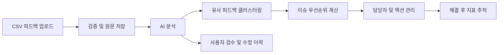

# VOC ActionOps

고객 리뷰, 문의, 설문 데이터를 반복 이슈로 구조화하고 우선순위 산정, 담당자 액션 관리, 해결 후 지표 추적까지 연결하는 AI 기반 고객 피드백 운영 플랫폼입니다.

단순 감성 분석 대시보드가 아니라, 흩어진 고객 피드백이 실제 개선 작업으로 이어지도록 만드는 운영 흐름을 구현하는 것이 목표입니다.

## 핵심 흐름


```mermaid
flowchart LR
    A[CSV 피드백 업로드] --> B[검증 및 원문 저장]
    B --> C[AI 분석]
    C --> D[유사 피드백 클러스터링]
    D --> E[이슈 우선순위 계산]
    E --> F[담당자 및 액션 관리]
    F --> G[해결 후 지표 추적]
    C --> H[사용자 검수 및 수정 이력]
```

## 설계 방향

- 원문 `Feedback`과 운영 단위 `Issue`를 분리한 도메인 설계
- AI 결과의 신뢰도, 원문 근거, 사용자 수정 이력을 남기는 Human-in-the-loop 구조
- 피드백 빈도, 부정 비율, 평균 긴급도를 반영하는 설명 가능한 우선순위 모델
- 조직 단위 데이터 격리와 역할 기반 권한 제어
- 영속화된 분석 작업, 항목별 재시도, 재시작 복구를 포함한 비동기 AI 분석
- 이슈 해결 전후 변화와 최근 증가율을 확인하는 일별 지표 스냅샷

## 기술 구성

### Backend

- Java 17
- Spring Boot 4.1
- Spring Web MVC, Spring Security, Spring Data JPA, Validation
- Flyway, Gradle 9

### Frontend

- React 19, TypeScript
- Vite, React Router
- Vitest, Testing Library
- Nginx

### AI Worker

- Python 3.13
- FastAPI, Pydantic
- OpenAI Responses API Structured Outputs
- pytest

### Data & Infrastructure

- MySQL 8.4
- Docker Compose
- GitHub Actions

### Test & API Documentation

- JUnit 5, H2
- Spring Security Test, MockMvc
- Spring Boot Actuator
- springdoc-openapi

## 저장소 구조

```text
.
|-- backend/                 Spring Boot API 서버
|-- ai-worker/               FastAPI 피드백 분석 Worker
|-- frontend/                React 운영 화면
|-- samples/                 로컬 확인용 VOC CSV
|-- docs/                    요구사항, 도메인, ERD, API 문서
|-- docker-compose.yml       전체 로컬 실행 환경
|-- .env.example             로컬 환경 변수 예시
`-- .github/workflows/       백엔드 및 AI Worker CI
```

## 로컬 실행

사전 준비: Docker Desktop

```bash
cp .env.example .env
docker compose up --build -d
```

MySQL이 준비되면 Flyway가 스키마를 적용하고, 백엔드는 데모 조직과 ADMIN 사용자를 한 번만 생성합니다. 로컬 데모 초기화는 `DEMO_DATA_ENABLED`로 끌 수 있습니다.

데모 계정:

- 이메일: `admin@voc-actionops.local`
- 비밀번호: `demo-password`

실행 후 확인할 수 있는 주소:

- Frontend: `http://localhost:3000`
- Backend Health Check: `http://localhost:8080/actuator/health`
- Swagger UI: `http://localhost:8080/swagger-ui.html`
- OpenAPI JSON: `http://localhost:8080/v3/api-docs`
- AI Worker Health Check: `http://localhost:8000/health`
- AI Worker API 문서: `http://localhost:8000/docs`

Swagger에서 로그인한 뒤 access token을 Authorize에 입력하면 `samples/demo-feedbacks.csv`로 업로드와 분석 흐름을 확인할 수 있습니다. CSV 컬럼은 API 시스템 필드명과 같으므로 `columnMapping`에는 각 헤더를 같은 이름으로 매핑하면 됩니다.

```json
{
  "external_id": "external_id",
  "content": "content",
  "customer_segment": "customer_segment",
  "product_name": "product_name",
  "rating": "rating",
  "language": "language",
  "feedback_created_at": "feedback_created_at"
}
```

로컬 환경 종료:

```bash
docker compose down
```

## 테스트

```bash
cd backend
./gradlew clean test

cd ../ai-worker
python -m venv .venv
source .venv/bin/activate
pip install -e ".[test]"
AI_WORKER_API_KEY=local-ai-worker-key pytest

cd ../frontend
pnpm install
pnpm lint
pnpm test
pnpm build
```

AI Worker는 기본적으로 재현 가능한 로컬 분석 provider를 사용합니다. 실제 모델을 사용할 때는 `AI_PROVIDER=openai`와 `OPENAI_API_KEY`를 설정합니다.

## 문서

- [문제 정의](docs/problem_definition.md)
- [요구사항](docs/requirements.md)
- [도메인 모델](docs/domain_model.md)
- [ERD](docs/erd.md)
- [API 명세](docs/api.md)
