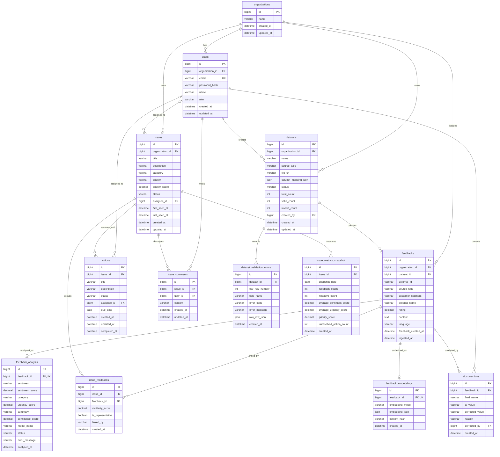

# VOC ActionOps ERD

고객 피드백 원문, AI 분석 결과, 반복 이슈, 실제 처리 액션을 분리하고 조직 단위 데이터 격리를 적용한 MySQL 기준 설계다.

- [ERDCloud에서 보기](https://www.erdcloud.com/d/xxDZWHiM8pZhwuqZJ)
- 아래 Mermaid ERD는 공개 저장소 안에서도 전체 구조를 확인할 수 있도록 같은 테이블과 관계를 표현한다.

## 전체 관계

## 핵심 제약

- `users.email`: `UNIQUE`
- `feedback_analysis.feedback_id`: `UNIQUE`로 피드백별 최신 분석 결과 1건 보장
- `feedback_embeddings.feedback_id`: `UNIQUE`로 피드백별 임베딩 1건 보장
- `issue_feedbacks(issue_id, feedback_id)`: 복합 `UNIQUE`
- `issue_metrics_snapshot(issue_id, snapshot_date)`: 복합 `UNIQUE`
- 모든 핵심 조회는 `organization_id`를 기준으로 격리

## 구현 단계

1차 MVP는 `organizations`, `users`, `datasets`, `dataset_validation_errors`, `feedbacks`, `feedback_analysis`, `issues`, `issue_feedbacks`, `actions`, `ai_corrections`를 구현한다.

2차에서 `feedback_embeddings`, `issue_comments`를 추가하고, 성능 개선 단계에서 `issue_metrics_snapshot`을 적용한다.
