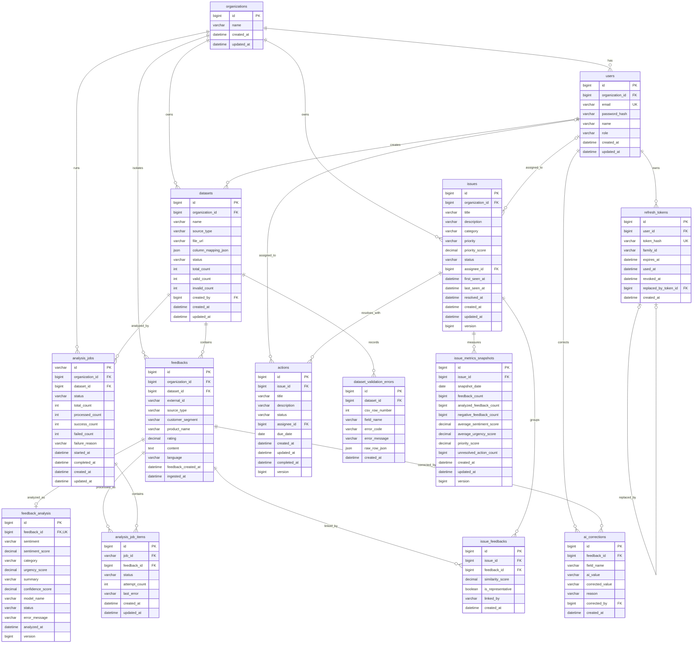

# VOC ActionOps ERD

고객 피드백 원문, AI 분석 결과, 반복 이슈, 실제 처리 액션을 분리하고 조직 단위 데이터 격리를 적용한 MySQL 기준 설계다.

- [ERDCloud에서 보기](https://www.erdcloud.com/d/xxDZWHiM8pZhwuqZJ)
- 아래 Mermaid ERD는 현재 마이그레이션으로 생성되는 테이블과 관계를 표현한다.

## 전체 관계

```mermaid
erDiagram
    organizations ||--o{ users : has
    organizations ||--o{ datasets : owns
    organizations ||--o{ feedbacks : isolates
    organizations ||--o{ issues : owns
    organizations ||--o{ analysis_jobs : runs

    users ||--o{ datasets : creates
    users ||--o{ refresh_tokens : owns
    users o|--o{ issues : assigned_to
    users o|--o{ actions : assigned_to
    users ||--o{ ai_corrections : corrects

    datasets ||--o{ dataset_validation_errors : records
    datasets ||--o{ feedbacks : contains
    datasets ||--o{ analysis_jobs : analyzed_by

    feedbacks ||--o| feedback_analysis : analyzed_as
    feedbacks ||--o{ analysis_job_items : processed_as
    feedbacks ||--o{ issue_feedbacks : linked_by
    feedbacks ||--o{ ai_corrections : corrected_by

    analysis_jobs ||--o{ analysis_job_items : contains
    issues ||--o{ issue_feedbacks : groups
    issues ||--o{ actions : resolves_with
    issues ||--o{ issue_metrics_snapshots : measures
    refresh_tokens o|--o| refresh_tokens : replaced_by

    organizations {
        bigint id PK
        varchar name
        datetime created_at
        datetime updated_at
    }

    users {
        bigint id PK
        bigint organization_id FK
        varchar email UK
        varchar password_hash
        varchar name
        varchar role
        datetime created_at
        datetime updated_at
    }

    refresh_tokens {
        bigint id PK
        bigint user_id FK
        varchar token_hash UK
        varchar family_id
        datetime expires_at
        datetime used_at
        datetime revoked_at
        bigint replaced_by_token_id FK
        datetime created_at
    }

    datasets {
        bigint id PK
        bigint organization_id FK
        varchar name
        varchar source_type
        varchar file_url
        json column_mapping_json
        varchar status
        int total_count
        int valid_count
        int invalid_count
        bigint created_by FK
        datetime created_at
        datetime updated_at
    }

    dataset_validation_errors {
        bigint id PK
        bigint dataset_id FK
        int csv_row_number
        varchar field_name
        varchar error_code
        varchar error_message
        json raw_row_json
        datetime created_at
    }

    feedbacks {
        bigint id PK
        bigint organization_id FK
        bigint dataset_id FK
        varchar external_id
        varchar source_type
        varchar customer_segment
        varchar product_name
        decimal rating
        text content
        varchar language
        datetime feedback_created_at
        datetime ingested_at
    }

    feedback_analysis {
        bigint id PK
        bigint feedback_id FK,UK
        varchar sentiment
        decimal sentiment_score
        varchar category
        decimal urgency_score
        varchar summary
        decimal confidence_score
        varchar model_name
        varchar status
        varchar error_message
        datetime analyzed_at
        bigint version
    }

    analysis_jobs {
        varchar id PK
        bigint organization_id FK
        bigint dataset_id FK
        varchar status
        int total_count
        int processed_count
        int success_count
        int failed_count
        varchar failure_reason
        datetime started_at
        datetime completed_at
        datetime created_at
        datetime updated_at
    }

    analysis_job_items {
        bigint id PK
        varchar job_id FK
        bigint feedback_id FK
        varchar status
        int attempt_count
        varchar last_error
        datetime created_at
        datetime updated_at
    }

    issues {
        bigint id PK
        bigint organization_id FK
        varchar title
        varchar description
        varchar category
        varchar priority
        decimal priority_score
        varchar status
        bigint assignee_id FK
        datetime first_seen_at
        datetime last_seen_at
        datetime resolved_at
        datetime created_at
        datetime updated_at
        bigint version
    }

    issue_feedbacks {
        bigint id PK
        bigint issue_id FK
        bigint feedback_id FK
        decimal similarity_score
        boolean is_representative
        varchar linked_by
        datetime created_at
    }

    actions {
        bigint id PK
        bigint issue_id FK
        varchar title
        varchar description
        varchar status
        bigint assignee_id FK
        date due_date
        datetime created_at
        datetime updated_at
        datetime completed_at
        bigint version
    }

    ai_corrections {
        bigint id PK
        bigint feedback_id FK
        varchar field_name
        varchar ai_value
        varchar corrected_value
        varchar reason
        bigint corrected_by FK
        datetime created_at
    }

    issue_metrics_snapshots {
        bigint id PK
        bigint issue_id FK
        date snapshot_date
        bigint feedback_count
        bigint analyzed_feedback_count
        bigint negative_feedback_count
        decimal average_sentiment_score
        decimal average_urgency_score
        decimal priority_score
        bigint unresolved_action_count
        datetime created_at
        datetime updated_at
        bigint version
    }
```

## 핵심 제약

- `users.email`: `UNIQUE`
- `refresh_tokens.token_hash`: `UNIQUE`, refresh token 원문 대신 SHA-256 해시 저장
- `refresh_tokens.replaced_by_token_id`: rotation으로 교체된 다음 토큰을 self-reference
- `feedback_analysis.feedback_id`: `UNIQUE`로 피드백별 최신 분석 결과 1건 보장
- `feedback_analysis`: 점수 범위와 PENDING/SUCCESS/FAILED 상태별 필수 데이터 조합을 `CHECK`로 검증
- `analysis_job_items(job_id, feedback_id)`: 복합 `UNIQUE`, 작업별 중복 분석 방지
- `issue_feedbacks(issue_id, feedback_id)`: 복합 `UNIQUE`
- `issues`: ASSIGNED 이후 상태에는 담당자가 필요하고, 최초·최근 발생 시각의 역전을 방지
- `actions`: DONE 상태에만 `completed_at`을 저장
- `issue_metrics_snapshots(issue_id, snapshot_date)`: 복합 `UNIQUE`
- 모든 핵심 조회는 `organization_id`를 기준으로 격리
